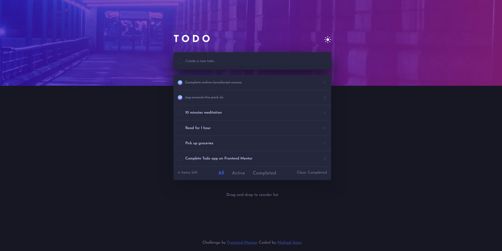
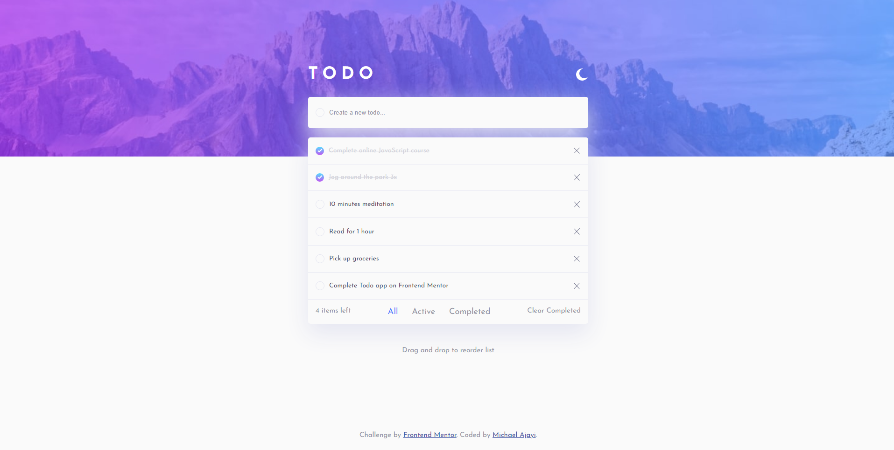

# Frontend Mentor - Todo app solution

This is a solution to the [Todo app challenge on Frontend Mentor](https://www.frontendmentor.io/challenges/todo-app-Su1_KokOW). Frontend Mentor challenges help you improve your coding skills by building realistic projects.

## Table of contents

- [Overview](#overview)
  - [The challenge](#the-challenge)
  - [Screenshot](#screenshot)
  - [Links](#links)
- [My process](#my-process)
  - [Built with](#built-with)
  - [What I learned](#what-i-learned)
  - [Continued development](#continued-development)
  - [Useful resources](#useful-resources)
- [Getting Started](#getting-started)
  - [System Requirements](#system-requirements)
  - [Installation](#installation)
  - [Bugs](#bugs)
  - [Contributing](#contributing)
- [Author](#author)

## Overview

### The challenge

Users should be able to:

- View the optimal layout for the app depending on their device's screen size
- See hover states for all interactive elements on the page
- Add new todos to the list
- Mark todos as complete
- Delete todos from the list
- Filter by all/active/complete todos
- Clear all completed todos
- Toggle light and dark mode
- **Bonus**: Drag and drop to reorder items on the list
- **Bonus**: Build this project as a full-stack application

### Screenshot
You can switch the theme of the app to either dark or light according to your desire

A view of how the dark theme should look like


A view of how the light theme looks like


It can check out all design in the [design folder](./design/)

### Links

- Solution URL: [Add solution URL here](https://your-solution-url.com)
- Live Site URL: [Add live site URL here](https://your-live-site-url.com)

## My process

### Built with

- Semantic HTML5 markup
- CSS custom properties
- Flexbox
- CSS Grid
- Mobile-first workflow
- CSS Animations
- [React](https://reactjs.org/) - JS library
- [Vite](https://vitejs.dev/) - JS Rapid Development Tool
- [Styled Components](https://styled-components.com/) - For styles

### What I learned

I have previous done this project before as a beginner but I didnt have a design template, I was very bad with colors and HTML tags placement... On finishing this task/challenge, I realized that I have improved drastically over the years and learnt the importance of color scheme, how they can be used effectively...

I also learnt some Array Method that makes my code cleaner and perhaps even faster... like the filter and map methods. I am familiar with this methods but i have not really seen them in real action or power...

```js
  let storedTask = [] // An array with lot of stuffs
  storedTask = storedTask.filter((obj) => {
      return obj.id !== task.id;
    });
```

### Continued development

Any additional development might be added later on but for now, this is all [the features](#the-challenge) this app have.

### Useful resources

- [Drag and Drop in React](https://www.youtube.com/watch?v=CYKDtVZr_Jw) - This helped me learn a faster method to get and use more effectively the dragged, dragged over and dragend events

## Getting Started

In order to view this project locally, you need to make sure you clone this repository and install it's dependencies.

### System Requirements

- [git][https://git-scm.com/] 2.31.1 or greater
- [node][https://nodejs.org/en/] 14.16.1 or greater
- [npm][https://nodejs.org/en/] 8.7.0 or greater

To check which versions you have installed you can run these commands:
```
git --version
node --version
npm --version
```
If requirements above are not installed in your computer, you'll need to install them. By clicking on them you can go to their website, which can lead you the way.

### Installation

- Clone the repository
  ```sh
  git clone https://github.com/denielden/react-qrcode-generator.git
  ```
- Navigate to repository folder
  ```sh
  cd qrcode-generator
  ```
- Install npm packages
  ```sh
  npm install
  ```
- To run the app in the development mode run in the project directory: 
  ```sh
  npm run dev
  ```

### Bugs

Please feel free to create an issue if you see a bug or something unexpected in the app.

### Contributing

- Fork the Project
- Create your Feature Branch (`git checkout -b feature/yourFeature`)
- Commit your Changes (`git commit -m 'Brief explanation of feature`')
- Push to the Branch (`git push origin feature/yourFeature`)
- Open a Pull Request

## Author

- Website - [Michael Ajayi](https://michael-a.netlify.app)
- Frontend Mentor - [@michaelajayi150](https://www.frontendmentor.io/profile/michaelajayi150)
- Twitter - [@michaelajayi150](https://www.twitter.com/michaelajayi150)
- LinkedIn - [@ajayi-michael-692bb6203](https://www.linkedin.com/in/ajayi-michael-692bb6203/)
